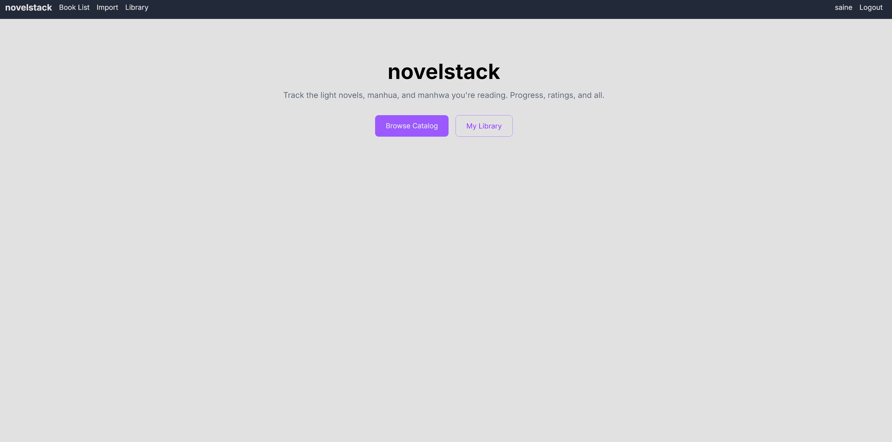
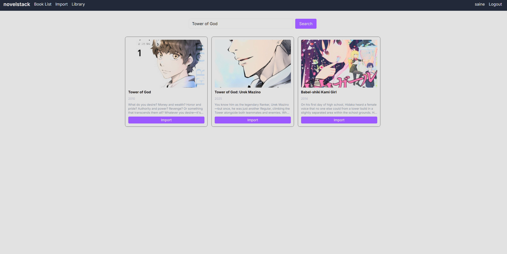
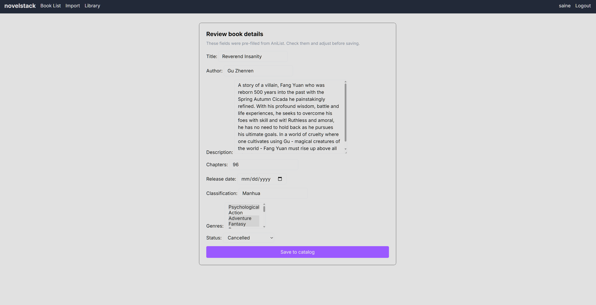
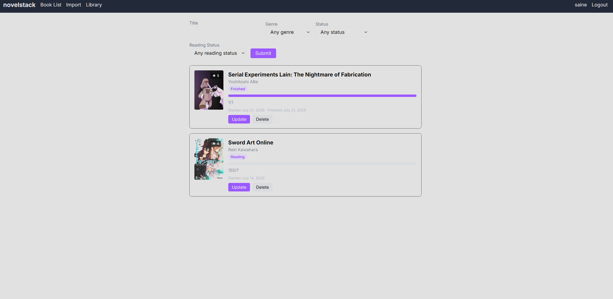

# novelstack

## About

novelstack is an Asian entertainment library and reading tracker to track your reading progress.

I built novelstack because I've been reading novels and books for years, and while I use AniList as my primary tracker, I thought it would be an awesome idea to create one on my own to see just what goes into making something of that scale, even if it's only 1/10th of AniList.

## Live Demo

> [novelstack](http://35.170.80.39:8000/)

## Features

- Public book catalog anyone can browse, search, and filter by title, genre, and status
- Personal library to add books and track reading status, progress, rating, and dates
- Profile page with your reading stats
- Import books from the AniList API through a staff-only, human-reviewed form
- Genres stored relationally with exact-membership filtering
- User auth with registration, login, and password reset
- Pydantic validation on all incoming AniList data
- Database-level data integrity with unique constraints and reading progress capped at total chapters
- pytest coverage across mapping, views, access control, and models
- Deployed on AWS with ECS Fargate and RDS PostgreSQL

## Architecture & Deployment

- **Docker (multi-stage build)**: stage 1 builds the Tailwind output CSS from the template classes, then stage 2 pulls that CSS in when containerizing the actual app. Keeps the Tailwind executable out of the final image.
- **ECR**: stores the image.
- **ECS Fargate**: runs the container, no server to manage like EC2.
- **RDS PostgreSQL (private)**: the database. No public IP, only the app can reach it.
- **Security group**: firewall. The database only accepts connections from the app's security group, nothing from the internet.
- **Runtime environment variables**: nothing hardcoded. Secrets and config injected at runtime.
- **Migration task**: migrations run as a one-off task inside the VPC, since the database is private.

## Cost

Runs roughly $5-20/month.

- **Fargate** (0.25 vCPU, 0.5 GB, 24/7): ~$5/month
- **RDS db.t3.micro** (Postgres, single-AZ): ~$15/month
- **Storage** (20 GB): minimal

### What I skipped, and why

- **NAT gateway** (~$32/month): lets a private-subnet task reach the internet to pull the image. Skipped by running the task in a public subnet with a locked security group instead. The DB stays private either way.
- **ALB** (~$22/month): gives a stable hostname and a place for HTTPS. Not worth it for a portfolio piece. The bare IP is fine for a demo, and I'd add it when the project needs a real URL.
- **Multi-AZ RDS**: doubles the database cost for automatic failover. Not needed for a portfolio piece.

## Tech Stack

- **Django 6.0**: full-featured web framework, handles the ORM, auth, forms, and admin by default.
- **PostgreSQL**: relational database, native AWS RDS compatibility for production.
- **psycopg2**: the driver that lets Django talk to PostgreSQL.
- **Pydantic**: validates and types the raw AniList GraphQL responses before they hit the mapping layer.
- **requests**: sends the GraphQL queries to the AniList API.
- **Tailwind CSS**: handles all the styling.
- **Gunicorn**: production web server that runs the app in the container, since Django's built-in server isn't meant for production.
- **WhiteNoise**: serves the app's CSS and images without needing a separate server.
- **Docker**: containerizes the app for consistent local dev and AWS deployment.
- **AWS (ECR, ECS Fargate, RDS)**: ECR stores the image, Fargate runs the container with no server management, RDS hosts the production database.
- **pytest**: unit and view tests across the mapping layer, access control, and models.

## Running Locally

1. Clone the repo

```bash
git clone https://github.com/saineee/novelstack.git
cd novelstack
```

2. Create a `.env.docker` file in the project root using `.env.docker.example` as a template

```bash
cp .env.docker.example .env.docker
```

Then fill in your own `SECRET_KEY` and database credentials.

3. Run with Docker

```bash
docker compose up --build
```

4. Visit `http://localhost:8000`

## Screenshots

### Home



### Import search



### Import review



### Library



## Data Source

novelstack pulls book data from the AniList GraphQL API. I originally chose WLN Updates for cover art, but saw it was dead (its API had been erroring for over a year), so I pivoted to something more reliable and just went with the API of the tracker I already use. GraphQL is annoying compared to REST, but it works.

The import is human-reviewed because AniList's data is wrong often enough that a person should check it before it saves.

## Known Issues

- The author field is often blank on import. AniList stores authors as staff roles with inconsistent labels, so some combinations don't map cleanly and have to be filled in by hand on the review form.
- The live demo runs on a bare public IP with no load balancer, so the address can change if the container restarts. A stable domain and HTTPS are planned when the project moves to a load balancer.

## License

MIT